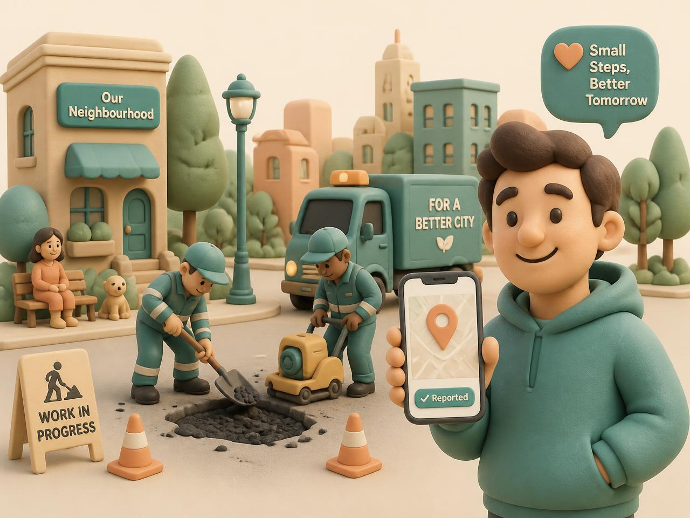

# CivicConnect AI

A production-quality, responsive full-stack web application for crowdsourced civic issue reporting and resolution. Citizens snap a photo, drop a pin, and describe a problem; an AI assistant classifies the issue, estimates severity, and routes it to the right municipal department. Admins triage complaints, track resolution metrics, and manage users and departments.



## Live Demo

- **Published app:** https://citizen-civic-ai.lovable.app
- **Preview:** https://id-preview--8c5d3162-70c9-4806-91d1-d257d0516358.lovable.app

### Demo credentials

| Role | Email | Password |
|------|-------|----------|
| Citizen | `citizen@civicconnect.demo` | `Demo1234!` |
| Admin | `admin@civicconnect.demo` | `Demo1234!` |

Use the **Citizen demo** or **Admin demo** one-tap buttons on the sign-in page to log in instantly.

## Features

### For citizens

- **Report in seconds** — take a photo, add a note, and confirm the location on an interactive map.
- **AI classification** — Civi, the built-in AI assistant, classifies the issue (pothole, garbage, water leakage, etc.), estimates severity, and writes a summary for the department.
- **Duplicate detection** — similar nearby reports are surfaced so citizens don't file duplicate complaints.
- **Live tracking** — follow the complaint status from reported → AI analyzed → assigned → in progress → resolved → citizen verified.
- **Personal dashboard & map** — view all your reports and their locations.
- **Civi assistant** — ask plain-language questions about your complaints and the platform.

### For administrators

- **City-wide dashboard** — see total reports, open issues, resolution rate, and average resolution time.
- **Complaint queue** — filter, search, triage, assign, and update statuses.
- **Triage detail view** — view AI analysis, location, history, and route issues to departments.
- **Interactive city map** — visualize all issues and hotspot heat circles.
- **Analytics** — Recharts-powered trends, category distribution, priority mix, and resolution performance.
- **Department management** — view municipal departments and their workload.
- **User management** — promote citizens to admin and manage roles securely.
- **First-admin bootstrap** — when no admin exists, a signed-in citizen can claim admin access from their profile.

### Analytics demo

A dedicated `/analytics-demo` route generates 420 synthetic complaints across 180 days so you can explore trends interactively with filters for time range, grouping (day/week/month), ward, category, and status — and download the filtered dataset as CSV.

## Tech stack

- **Framework:** [TanStack Start](https://tanstack.com/start) (React 19, SSR/SSG, file-based routing)
- **Backend & Auth:** Lovable Cloud / Supabase
- **Database:** PostgreSQL with Row Level Security (RLS)
- **Styling:** Tailwind CSS v4 with a custom OKLCH color system and Premium Claymorphism design tokens
- **UI components:** shadcn/ui + Radix UI primitives
- **Charts:** Recharts
- **Maps:** Leaflet (client-only, SSR-safe)
- **AI:** Lovable AI Gateway (Gemini 2.5 Flash) for classification and the Civi assistant
- **Language:** TypeScript
- **Build tool:** Vite 8

## Project structure

```text
src/
├── components/
│   ├── civic/          # App-specific components (Logo, AppShell, IssueCard, CivicMap, etc.)
│   └── ui/             # shadcn/ui primitives
├── hooks/
│   └── useAuth.tsx     # Global auth context (session, profile, role)
├── integrations/
│   └── supabase/       # Generated Supabase clients, middleware, and auth helpers
├── lib/
│   ├── ai.functions.ts # Server functions for AI classification, Civi, and role management
│   ├── ai.server.ts    # AI gateway client
│   ├── civic.ts        # Domain constants and helpers
│   ├── demo-analytics.ts
│   ├── image.ts        # Client-side image compression
│   ├── issues.ts       # TanStack Query options for issues and departments
│   └── sitemap.ts      # SEO sitemap helper
├── routes/             # TanStack file-based routes
│   ├── index.tsx       # Landing page
│   ├── login.tsx
│   ├── register.tsx
│   ├── analytics-demo.tsx
│   ├── citizen.*.tsx   # Citizen routes
│   ├── admin.*.tsx     # Admin routes
│   └── sitemap[.]xml.ts
├── assets/             # Images
├── styles.css          # Global design tokens and claymorphism utilities
└── start.ts            # TanStack Start configuration
```

## Getting started

### Prerequisites

- Node.js 20+ (recommended via [nvm](https://github.com/nvm-sh/nvm))
- npm or bun
- A Lovable Cloud / Supabase project (or bring your own Supabase backend)

### Install

```sh
git clone <this-repository-url>
cd <repository-name>
npm install
```

### Environment variables

Create a `.env` file in the project root with at least:

```env
VITE_SUPABASE_URL=https://<project>.supabase.co
VITE_SUPABASE_PUBLISHABLE_KEY=<your-anon-key>
```

Server-only variables (used by `createServerFn`):

```env
SUPABASE_SERVICE_ROLE_KEY=<your-service-role-key>
LOVABLE_API_KEY=<your-lovable-api-key>
```

> **Note:** On Lovable Cloud, these secrets are managed for you. When running locally or self-hosting, set them in your hosting environment. Never commit secrets to Git.

### Run locally

```sh
npm run dev
```

Open http://localhost:8080.

### Build

```sh
npm run build
```

Preview the production build:

```sh
npm run preview
```

## Database schema

Key tables:

- `profiles` — user profiles linked to `auth.users`.
- `user_roles` — separate role table (`citizen`, `admin`) with a `private.has_role` security definer helper.
- `departments` — municipal departments.
- `issues` — civic complaints with auto-incrementing complaint numbers (`CIV-XXXX`).
- `issue_updates` — status and assignment history.
- `ai_analysis` — AI classification results.
- `duplicate_links` — duplicate complaint relationships.

All tables have RLS enabled. Storage bucket `issue-images` enforces owner/admin policies.

## Authentication & roles

- Email/password sign-in is enabled.
- New users register as citizens.
- The first admin can be bootstrapped from the citizen profile page when no admin exists.
- Subsequent admins are promoted by existing admins in **Admin Console → Users**.
- Roles are stored in a separate `user_roles` table; admin checks always happen server-side.

## Security

Recent fixes applied:

- Leaked password protection (HIBP) enabled.
- Role helper moved to a private schema and no longer exposed as a public RPC.
- Storage policies enforce ownership on issue images.
- RLS policies restrict data access to owners and admins.

## SEO

- Unique titles and meta descriptions on every route.
- `/sitemap.xml` generated from the route tree.
- `robots.txt` references the sitemap.

## License

This project was built with [Lovable](https://lovable.dev). The code is yours — feel free to fork, modify, and deploy it anywhere.
